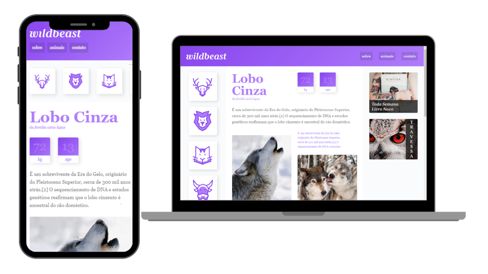

# Wildbeast
 Projeto para aplicação de estudos sobre CSS Grid Layout - Curso Origamid.  
 [Acesse o Wildbeast!🐺](https://wildbeast-seven.vercel.app/)
 

 ## Pontos importantes de aprendizado.
 - grid-template-areas
 - navbar mobile
 - responsividade com grid
 - reestruturação de grid com grid-areas 

